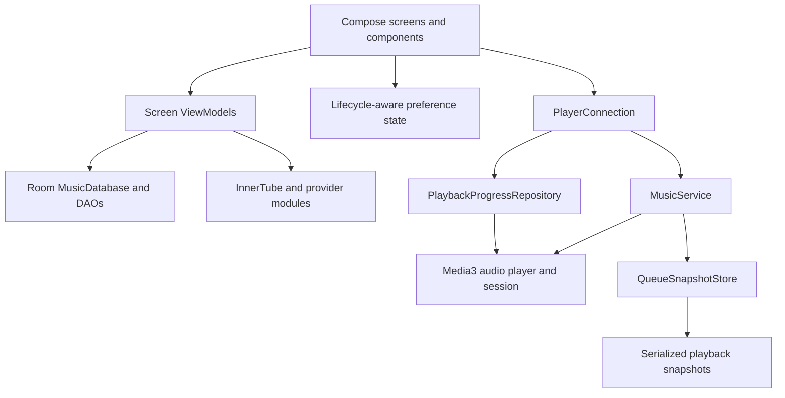

# Application architecture

## Responsibilities



- `ui/`: Material 3 Expressive theme, screens, reusable controls, menus, and player
  presentation. UI flow collection uses `collectAsStateWithLifecycle` so stopped
  screens release their subscriptions. Screen commands go to ViewModels or the
  playback connection. Existing screen/database integrations remain in this app;
  this is an incremental architecture, not a complete domain-layer rewrite.
- `viewmodels/`: screen state and asynchronous screen operations using ViewModel
  lifetimes. `db/` owns Room storage and migrations. Provider modules (`innertube`,
  `lrclib`, `kugou`, `kizzy`, `jossredconnect`) keep their network integrations.
- `di/`: Hilt bindings for shared storage/network/playback dependencies.
- `playback/MusicService`: owns Media3, audio focus, queue commands, sleep timer,
  and media session. The service uses a supervisor scope and cancels it on destroy.
  Media3 reads and commands stay on Main; disk serialization stays off Main.
- `PlaybackProgressRepository`: one subscriber-driven progress stream for controls,
  lyrics, and Discord settings. Starts only with consumers; reads every 100 ms
  while playing, once per second while loading, and only on events when paused.
  Stops immediately when its last consumer leaves. The source interface makes
  timing and lifecycle behavior testable without Android or a real player.
- `QueueSnapshotStore`: Hilt process singleton with one serial I/O consumer and a
  conflated pending snapshot. Captures queue state before I/O, prevents overlapping
  file truncation, and uses AtomicFile per file. It can finish the final queued
  snapshot after the playback service stops. A sudden process kill can still lose
  an in-flight checkpoint; the three legacy files are not a cross-file transaction.
- `PlayerConnection`: bridges the UI and service, owns its child scope/listeners,
  and removes them on dispose. Its widget ticker runs only for installed widgets
  while playback advances and the display is interactive. Widget progress updates
  use partial RemoteViews updates without loading artwork again.

## Material 3 design

`ui/theme/Theme.kt`, `Shapes.kt`, and `Type.kt` define the shared color scheme,
shape tokens and typography. Dynamic colors, dark mode and pure black preferences
remain available. The main navigation, dialogs, controls and surfaces use Material
3. Player appearance preferences remain supported; duplicate full-screen blur and
gradient rendering has been removed.

Functional icons use **Material Symbols Rounded, 24 px, regular weight**, with
filled variants for selected navigation and playback controls. Resource IDs remain
stable. Compose controls provide semantic tint through MaterialTheme. Directional
navigation vectors support RTL where appropriate. App/provider logos and shape
backgrounds retain their own assets. These logos are not Material Symbols.

See `third-party/material-symbols/manifest.json` for the exact upstream revision,
resource-to-symbol mapping, and preserved brand assets; `LICENSE` in that directory
contains the upstream Apache 2.0 license. Icons are checked in, with no runtime
font download or icon network dependency. The old extended Compose icon dependency
has been removed.

## Resource use

- All consumers share progress samples; separate 50/100 ms screen polling loops
  have been removed. Lifecycle collection stops UI work when the app is stopped.
- Queue checkpoints use one 30-second loop only during playback. Event-driven
  saves are debounced. The previous 10- and 30-second loops are gone.
- Preference composition starts from its declared default and collects asynchronously,
  avoiding synchronous DataStore reads during recomposition. A saved setting is
  displayed when DataStore emits its first value.
- Artwork operations reuse Coil's application ImageLoader/cache. Palette requests
  decode a 128 px image. Storage counters share a visible-only two-second sampler.
- Playing indicators animate only while their lifecycle is started. Greeting,
  about and recommendation decoration stays static; user interaction and finite
  transition animations remain. Media3's playback wake mode is retained for
  uninterrupted background audio.

## Verification

```sh
python3 scripts/check-kotlin-headers.py
./gradlew assembleDebug test lintDebug :app:minifyReleaseWithR8 --warning-mode all
```

The progress repository tests cover idle subscriptions, sharing, pause/seek,
buffering, invalid durations and resubscription. Queue writer tests cover conflation, clear ordering and recovery after write failures.
Existing tests cover backup
archive validation and extractor HTTP/TLS behavior.

Device validation is still required before release: playback/seek with lyrics,
background and screen-off playback, pause/resume, widget updates, queue restoration,
RTL and dark/light UI. Compare CPU, frame timing and battery on the same device,
songs and brightness before claiming numerical savings. Local JVM/build checks do
not measure battery or GPU usage.
